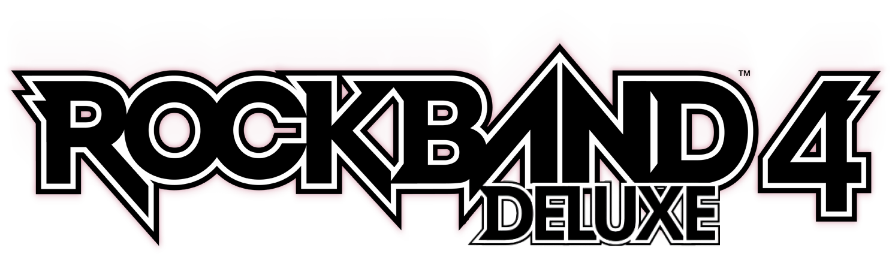
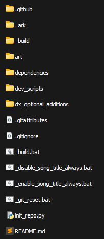

<div align="center">



## *Rock Band 4 Deluxe* is a Quality-of-Life Improvement Mod for PlayStation 4.

### 👉 See [Full Feature List](https://github.com/hmxmilohax/rock-band-4-deluxe/blob/main/dependencies/features.md#features)

### 📥 [Download Now!](#%EF%B8%8F-what-youll-need)

</div>

# ✍️ What You'll Need

### Playing *Rock Band 4 Deluxe* requires these things:

- a Hackable PS4 running GoldHEN 2.3.0+ (sytem software 11.00 or lower)
- a copy of Rock Band 4 version 2.21 (shows up as 2.3.7 in game) installed on your PS4.

<br/>

# 📥 Downloads

*Rock Band 4 Deluxe recieves infrequent updates. You can click the `Watch` button (All Activity) to be notified about any updates that occur.*


### 📥 [Playstation 4](https://nightly.link/hmxmilohax/rock-band-4-deluxe/workflows/build/main/RB4DX-PS4.zip)

<br/>

> Continue to: 
    - [Installing](#-installing)
    
## 📩 Installing
**NOTE: You WILL need a JAILBROKEN (GoldHen 2.3.0+) PS4 in order to play this mod on console. We hope this is clear.**

download the latest release of the [GoldHEN plugins repository.](https://github.com/GoldHEN/GoldHEN_Plugins_Repository/releases/latest) install that to your PS4 following the instructions found [here.](https://github.com/GoldHEN/GoldHEN_Plugins_Repository#quick-start)

Download [**Rock Band 4 Deluxe**](#-downloads), Extract the zip somewhere on your PC.

Once that is complete, open the folder called `GoldHEN`.

Copy the `plugins` folder and `plugins.ini` file to `/data/GoldHEN/` on your PS4 or edit your current `plugins.ini` file to add these lines

```ini
; Rock Band 4 Deluxe Plugins
;US
[CUSA02084]
/data/GoldHEN/plugins/RB4DX-Plugin.prx
/data/GoldHEN/plugins/no_share_watermark.prx
;EU
[CUSA02901]
/data/GoldHEN/plugins/RB4DX-Plugin.prx
/data/GoldHEN/plugins/no_share_watermark.prx
```

after that, copy the `RB4DX` folder to your ps4 also in the folder `/data/GoldHEN/`.

If there is a `ps4` folder already in the `RB4DX` folder on your ps4, delete it before copying.

### Optional Additions

*Rock Band 4 Deluxe* Comes with many goodies to change/improve the game

All of them can be found in the dx_optional_additions folder in the download for RB4DX.

To install these, copy the `ps4` folder inside each optional addition to your ps4 in the folder `/data/GoldHEN/RB4DX/` **AFTER** copying the main rb4dx ps4 folder.

There is also a [tutorial for moving some in game HUD objects around](https://gist.github.com/LlysiX/839813295fb1c6ae1ae2ad60d40c646e) if you would like to personalize your RB4DX experience even more!

# 🔨 Building (NOT standard download and install)

### Installing Python (Required)

* Head to the [**Python downloads**](https://www.python.org/downloads/), download and install Python (version 3.9 or later).
  * ***Select "Add python.exe to PATH"*** on the installer.


### Initializing the Repo

* Go to the **[Releases](https://github.com/hmxmilohax/rock-band-4-deluxe/releases)** of this repo and **download `_init_repo.py`**.
  * Make a new **empty** folder, **put `_init_repo.py` in the folder, and run it**. This will pull the repo down for you and make sure you're completely up to date. **This will take some time.**

### ***The folder should look like this once it's done:***



### ✅ ***The Rock Band 4 Deluxe repo is now set up!***

From here, you can make any personal modifications to the game or build it yourself.

  * Run the `build.bat` script to build *Rock Band 4 Deluxe*.
  * Built contents will be in the `_build` folder on the root of the repo.

You can now return to [**Installing**](#-installing)

# 🖥️ Dependencies

[Git for Windows](https://gitforwindows.org/) - CLI application to allow auto updating Deluxe repo files

[Python](https://www.python.org/downloads/) - For user script functionality (NOTE: 3.9 or newer is highly recommended!)

[LibForge](https://github.com/mtolly/LibForge) - ForgeTool for modifying Rock Band 4 Textures

[DtxCS](https://github.com/InvoxiPlayGames/DtxCS) - For serializing Rock Band dtb files

[RB4DX-Plugin](https://github.com/LlysiX/RB4DX-Plugin) - GoldHEN Plugin used for loading RB4DX flies
